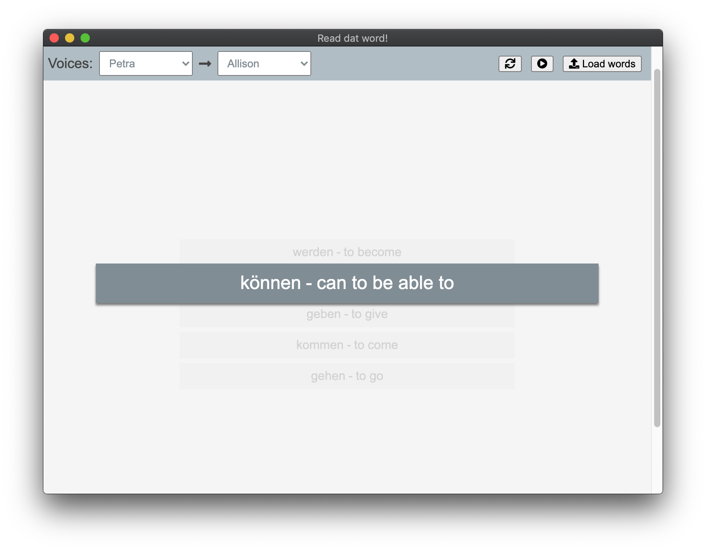

# wordsReader


An electron app that allows you to learn words by listening to original and translation with a correct pronunciation.



Allows you to download your file with any delimiter, for example:
```
to pick up - подбирать
to draw - рисовать
nightmare - кошмар
```
You can open this file and set "-" as a delimiter.

The app allows you to run auto-reading mode or read words by selecting them manually. It remembers your last position and starts from it next time you start the app.

## for Devs:
###